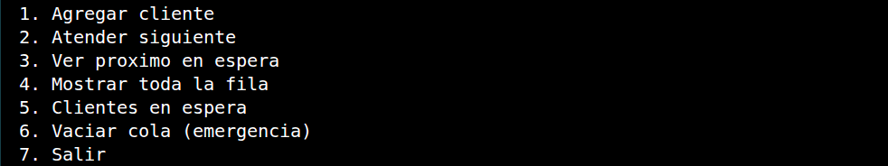

# sistema_banco
Lee Chourio

Proyecto sistema bancario

## Implementacion FIFO

En este proyecto la politica FIFO (First In, First Out) se implemento en la clase `controlador/ColaBanco.java` usando una `Queue<Cliente>` respaldada por una `LinkedList`.

Cuando en `vista/Main.java` se agrega un cliente, el metodo `encolar()` lo coloca al final de la cola. Luego, cuando se selecciona atender cliente, el metodo `atenderSiguiente()` usa `poll()` para sacar al primer cliente que entro. De esta manera, el sistema atiende a los clientes en el mismo orden en que llegaron.

# Imagen de compilación:

# link de diagrama UML

https://mermaid.ai/d/53e03623-1a52-40c5-a10e-0bed6bc5c52c

